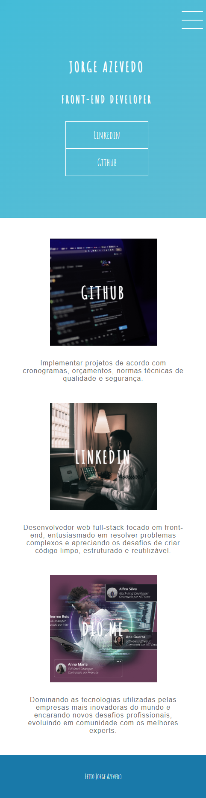

# DIO-HTML-CSS3

  

 

  

## 💻 Projeto
Desenvolvendo um menu hamburguer e morphing menu com CSS Transitions

## ✨ Tecnologias

-   [ ] HTML
-   [ ] CSS3

## 📄 Licença

Esse projeto está sob a licença MIT. Veja o arquivo [LICENSE](LICENSE.md) para mais detalhes.

 
